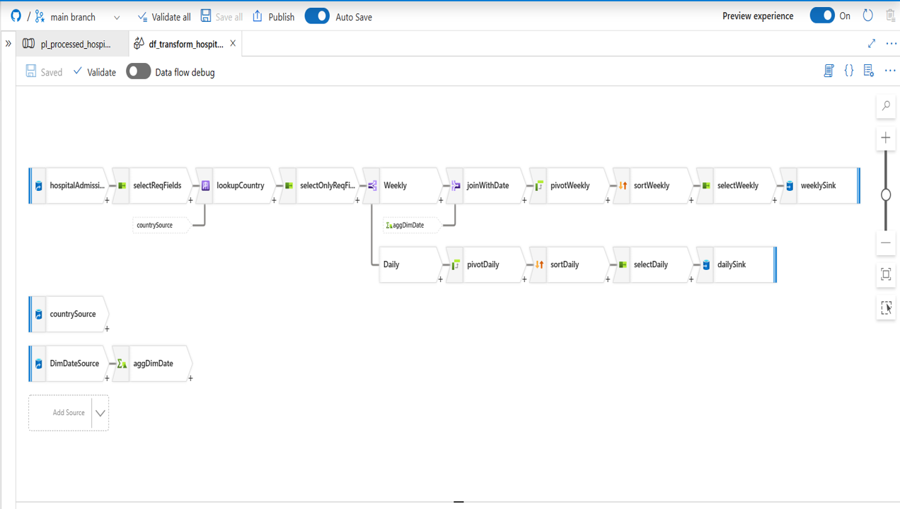
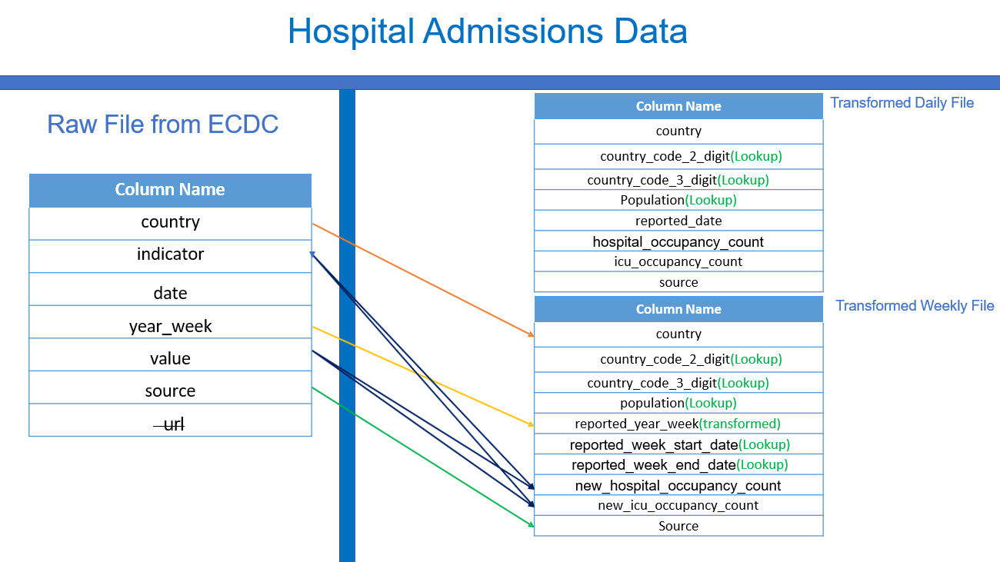
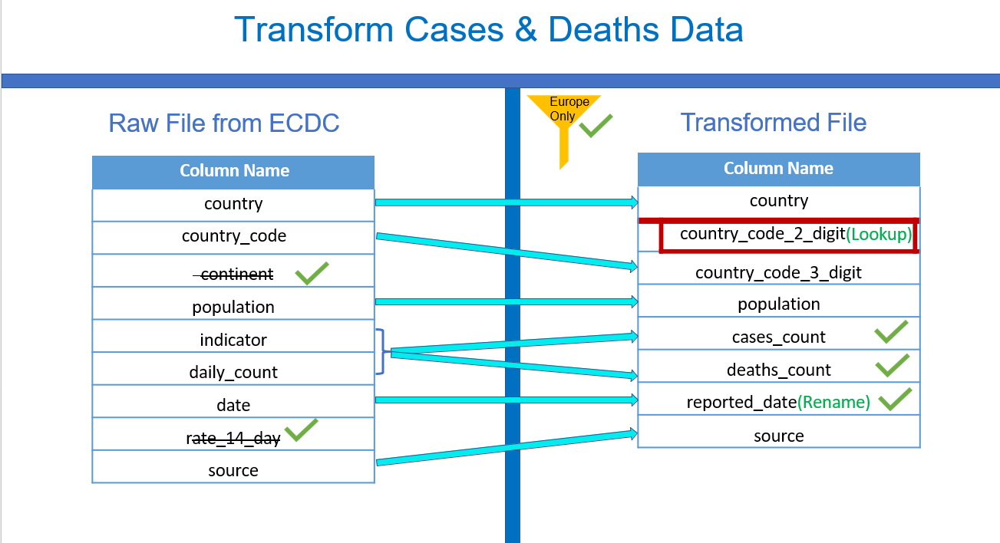
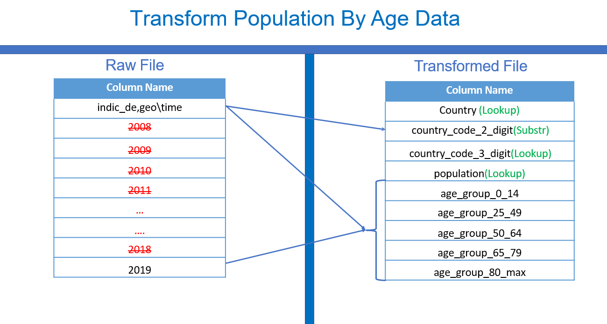
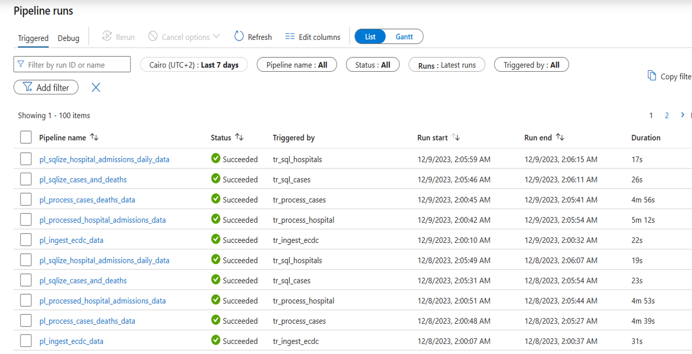
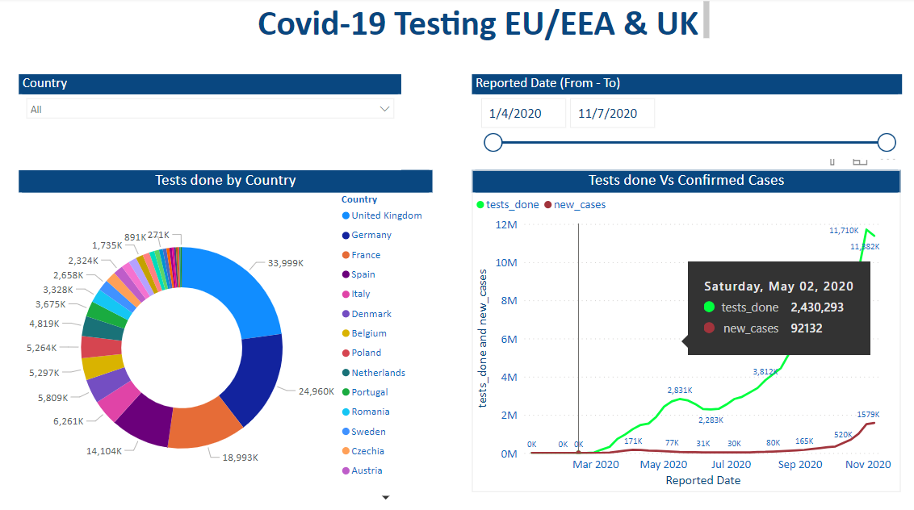

# Comprehensive Azure Azure Cloud Services: ECDC Covid-19 Reporting

## Overview

In this project, our focus is on creating a robust data platform utilizing Microsoft Azure Data Factory. The platform addresses two primary objectives related to the reporting and prediction of COVID-19 spread.

## Data Platform Components

### Data Lake
The Data Lake is populated with essential data to assist Data Scientists in predicting the virus's spread and mortality rates. This includes:
- Confirmed cases
- Mortality
- Hospitalization/ICU Cases
- Testing Numbers
- Country's population by age group

### Data Warehouse
The Data Warehouse stores a refined subset of data specifically tailored for reporting on trends, including:
- Confirmed cases
- Mortality
- Hospitalization/ICU Cases

### Data Sources
- [**ECDC Website:**](https://www.ecdc.europa.eu/en/covid-19) Provides data on confirmed cases, mortality, hospitalization/ICU cases, and testing numbers.
- [**Eurostat Website:**](https://ec.europa.eu/eurostat/web/main/home) Supplies population data categorized by age group.

## Solution Architecture

Our solution is designed to handle COVID-19 data efficiently, combining various tools and technologies to ensure a seamless process. Let's break down our solution architecture:

### Azure Data Factory
- Serves as our primary tool for data integration and orchestration.
- Provides connectors to all data sources in our project.
- Employs Data Flows for transforming data within the Data Factory.
- Orchestrates workflows, including running transformations in HDInsight and Azure databases.

## Storage Solutions
- **Azure Blob Storage:** Used to Store Eurostat population data.
- **Azure Data Lake Storage Gen 2:** Azure's recommended solution for building enterprise-level Data Lakes.
- **Azure Synapse Analytics:** Utilized as a data warehouse solution for our project.

## Data Ingestion
Data is ingested from different data sources into our Azure Data Lake Gen2 throughout the following Ingestion Process:
- We used the HTTP connector within Azure Data Factory to fetch COVID-19 data.
- Eurostat data is ingested from the Azure storage account into the data lake.

## Data Transformation
We've used three transformation technologies:
1. **Data Flow within Data Factory:** For code-free, simple to medium complexity transformations.
2. **HDInsight:** For more complex transformations requiring code in HiveQL.
3. **Azure Databricks:** For more complex transformations requiring code in PySpark.

## **Data Flow within Azure Data Factory :**
ADF Data Flow is used to transform the files containing the data of cases and deaths, and the hospital admissions data using the following pipelines:

### 1. **Transforming Hospital admissions data*
**Pipeline:**

**Transformations:**

### 2. **Transforming cases and deaths data**
**Pipeline:**

**Transformations:**

## **Azure Databricks:**
Databricks is used to trnsform the file containing the population data
 
###  The Following transformations are done on the file: 

 

Attached File : 
pyspark_notebooks/transform_population_data.py

## Data Orchestration with Azure Data Factory (ADF)

At the core of our project is the seamless orchestration of data, and Azure Data Factory (ADF) plays a central role in achieving this goal. Let's dive into how ADF effortlessly fulfills key requirements in our data orchestration process.

### Automatic Pipeline Executions
Azure Data Factory automates the execution of our pipelines, eliminating the need for manual oversight. This ensures a smooth and continuous flow of data without any interruptions.

### Flexible Scheduling
ADF provides the flexibility to schedule pipeline runs based on regular intervals or trigger events. This versatility allows us to adapt to various data processing needs seamlessly.

### Dependency Management
Azure Data Factory ensures data integrity by managing dependencies between activities within a pipeline. Activities execute only when their prerequisites are met, maintaining a coherent data processing flow.

### Triggered Execution
ADF facilitates the creation of triggers, ensuring our pipelines run reliably at designated times. This feature enables a timely and consistent execution of our data workflows.

### Screenshots - Triggers and Pipeline Runs

In the illustration below, you can see a snapshot of our data orchestration in action. The screenshot depicts the successful daily runs of our pipelines, triggered at consistent intervals:

This visual representation underscores the reliability of our data orchestration setup. Our pipelines consistently execute at designated times, and triggers are efficiently managed, aligning with our data orchestration requirements.

## Reporting

We Used Power BI for reporting trends extracted from our data.

### Dashboard

## Conclusion

This comprehensive solution architecture leverages the strengths of Azure Data Factory, various transformation technologies, and strategic storage solutions to handle COVID-19 data effectively. We've chosen tools based on simplicity, scalability, and compatibility with our specific project requirements.
